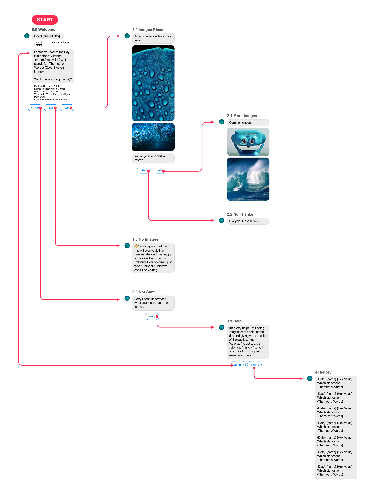
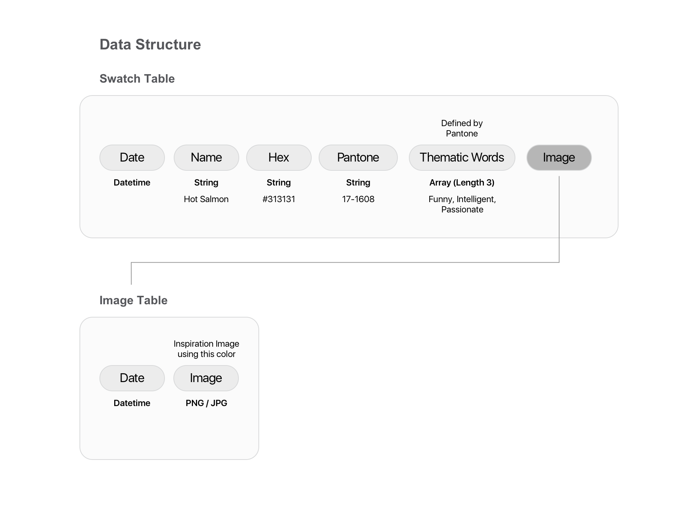

# Jasper
Inject color inspiration

## Proposal

### tl;dr

Jasper is a color tool to expand your color vocabulary and provide a new form of inspiration for all. 

### Full Description

Building on colors inspiration tools like [Adobe's Color](http://color.adobe.com), [Design Seeds](https://www.design-seeds.com/blog/) and [LOLColors](http://www.lolcolors.com). I want to give users daily color inspiration from Pantone's [color of the day](https://www.pantone.com/colorstrology). I would like to build a Slack bot1 to help users think about color in a new light (the Pantone light) and expand the user's color vocabulary. Additionally I would like users to have the option to request images that use that color for further inspiration. I plan to build this by pulling the color of the day from Pantone's [Twitter](https://twitter.com/PANTONE) account as all of their "colors of the day" use the hashtag *coloroftheday*. In the case there is not a color of the day a 404 style tweet will be provided on request and no Slack message will be sent for that day.

1If interfacing from Twitter to Slack becomes cumbersome alternatively I could use Twitter and have the user input come in the form of a tweet reply.

Additional if time permits I would like to also share the HEX code for the color of the day in the Slack message or the tweet.

Sadnote: Pantone does not store a list of all there daily colors, only the name of the color on twitter but the link provided only displays the most current day :(
## Matrix

| Effort/Priority | High   | Medium    | Low |
| --------------- | ------ | -------   | --- |
| **Low**         | Pull Tweets with #coloroftheday | clear formating | Creative error handling |
| **Medium**      | Store a list of requested colors from the user   |   Upload image of the color swatch | ... |
| **High**        | ...  | Include the Hex value (pull from CSS styling) | Pull images that use the color |

## Workflow Diagram

## Data Structure Diagram

